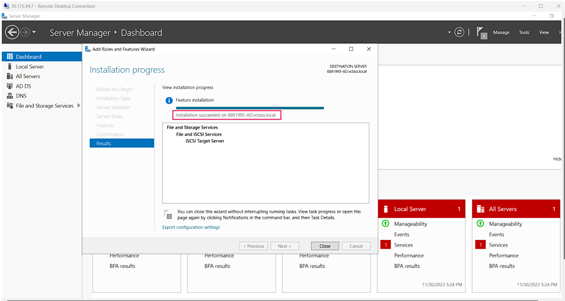
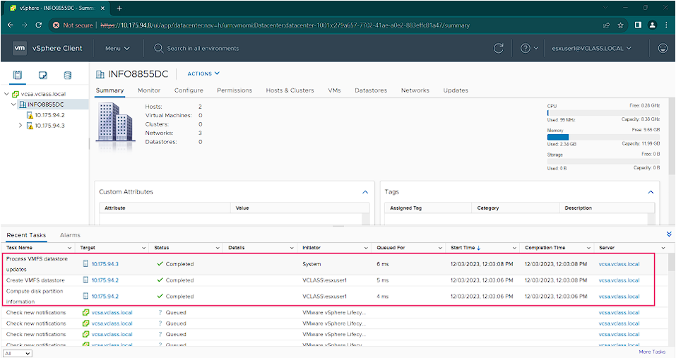

# 🔒 Private Cloud Lab – VMware vSphere Networking & High Availability

---

## 📖 Overview

This project demonstrates the design and implementation of a **private cloud infrastructure** using VMware vSphere, focusing on **network storage configuration (iSCSI), high availability, and vMotion**.  

Key components:  
- Windows Server as iSCSI Target  
- iSCSI LUN creation and configuration  
- vSphere storage network setup with VMkernel adapters  
- vMotion for live VM migration  
- High Availability (HA) cluster configuration  

---

## 🏗 Lab Sections

### 1. Network Storage Lab

**Objective:** Configure iSCSI storage in a virtualized environment.  

#### Task 1 – Configure Windows Server as iSCSI Target
- Added 100GB thin-provision disk & second network adapter  
- Created NTFS volume and installed iSCSI Target role  
- Secured storage traffic by isolating it to a dedicated network  

**Screenshot – Disk & Volume Creation:**  

  

**Screenshot – iSCSI Role Installation:**  

  

---

#### Task 2 – Configure iSCSI LUN
- Created virtual disk (LUN) for ESXi consumption  
- Enabled CHAP authentication for secure access  

**Screenshot – iSCSI LUN Configuration:**  

  

---

#### Task 3 – Configure vSphere Storage Network
- Created VMkernel adapters on ESXi hosts for iSCSI traffic  
- Optimized network communication for private storage  

**Screenshot – VMkernel Adapter on ESXi1:**  

  

**Screenshot – VMkernel Adapter on ESXi2:**  

  

---

#### Task 4 –  Create VMFS Datastore
- Configured VMFS datastore on iSCSI LUN for shared storage  
- Accessible by multiple ESXi hosts  

**Screenshot – Datastore Creation:**  

 

 

---

### 2. High Availability Lab

**Objective:** Implement vSphere HA and vMotion for continuous VM availability.  

#### Task 1 – Configure vMotion
- Added vMotion virtual switches and VMkernel adapters  
- Migrated powered-on Linux VM between hosts  

**Screenshot – vMotion Migration:**  

  

  

  

 

 

 

---

#### Task 2 – Configure High Availability Cluster
- Created HA cluster, added ESXi hosts, and enabled vSphere HA  

**Screenshot – HA Failover Event:**

  

  

  

- Tested failover by shutting down one host – VM automatically migrated

  

  

  

  Here we can see that the VM has moved to ESXI1 , earlier it was under ESXI2. After we shut down the ESXI2 the VM automatically migrated to ESXI1 which performs the HA feature.

  The log messages indicate the following events:
•	Detection of Failed Host:

  -	The alarm 'vSphere HA host status' on host "10.175.94.3" changed from Green to Red.
  -	vSphere HA detected that the host "10.175.94.3" is in a different network partition, signaling a potential issue.

•	Successful VM Failover:

  - The vSphere HA system reported a change in the availability state of the host "10.175.94.3" in the cluster "INCLASS8530-8."
  -	Following this, there are entries indicating that vSphere HA completed a virtual machine failover action, ensuring continued availability.

The log messages, which demonstrate the system's resilience and high availability characteristics, explain how vSphere HA alarms were used to identify a failing host and how virtual machines were successfully failover afterward.

---

## 🔑 Key Takeaways

- iSCSI LUNs provide **flexible, high-performance shared storage**  
- Dedicated VMkernel adapters **optimize storage communication and security**  
- vMotion enables **live VM migration** without downtime  
- HA clusters ensure **resilient, always-on infrastructure**  

---

